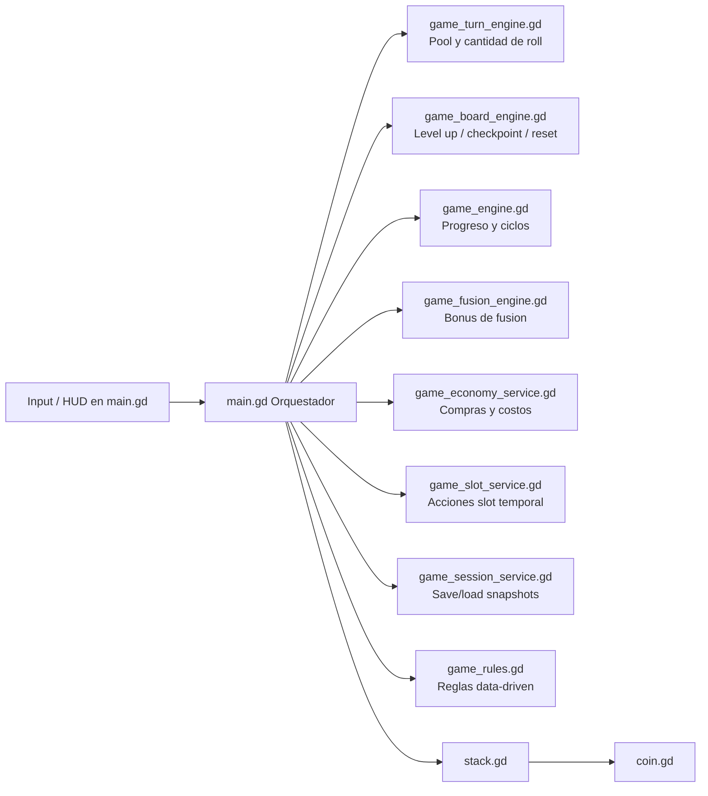
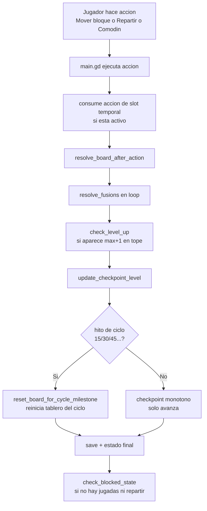

# Resumen de Codigo (actualizado)

Este documento describe como esta funcionando hoy el juego despues del refactor a arquitectura motor + UI.

Objetivo del refactor:
- `main.gd` orquesta escena, input y HUD.
- Las reglas y decisiones de juego se mueven a motores/servicios puros (`game_*.gd`).
- Las reglas clave quedan data-driven en `game_rules.gd`.

## Mapa rapido de archivos

### Orquestacion/UI
- `main.gd`: loop principal, input, resolucion, overlays, save/load.
- `stack.gd`: comportamiento de una pila (push, mover bloque superior, fusion visual).
- `coin.gd`: ficha individual y render.

### Motores y servicios (logica desacoplada)
- `game_engine.gd`: checkpoints, progreso, ciclos (15/30/45...).
- `game_board_engine.gd`: nivel up, decision de checkpoint, reset de ciclo.
- `game_turn_engine.gd`: armado de pool de tirada y cantidad de fichas a repartir.
- `game_fusion_engine.gd`: reglas de bonus por cadena de fusion.
- `game_economy_service.gd`: compras (slot temporal y slot adyacente).
- `game_slot_service.gd`: consumo de acciones de slot temporal y cursor de desbloqueos.
- `game_session_service.gd`: snapshot runtime/checkpoint y parseo de payload de save.
- `game_rules.gd`: constantes de reglas (por ejemplo cierre del slot temporal por acciones).

## Diagrama de arquitectura

## Mecanica actual (flujo de turno)

## Reglas clave que hoy impactan gameplay

- Movimiento: se mueve el bloque superior de valores iguales consecutivos.
- Destino valido: pila vacia o tope del mismo valor.
- Fusion: 10 iguales en una pila -> se compactan en una ficha de valor +1.
- Repartir: usa `roll_value_floor..(max_value-1)` y deja 1 hueco libre si es posible.
- Checkpoint: avanza solo si se supera el maximo previo (monotono).
- Reset de ciclo: cuando aparece una ficha hito (15, 30, 45...), se reinicia el tablero del ciclo con nuevo piso de valores.
- Slot temporal:
- se compra con estrellas,
- tambien tiene timer,
- y ademas consume acciones de juego hasta cerrarse (`TEMP_SLOT_ACTIONS_TO_CLOSE`).
- Si el slot temporal tiene fichas al vencer, no se cierra para evitar perder monedas.
- Slot adyacente permanente: se compra con estrellas y duplica precio, salvo desbloqueos gratis por nivel.
- Bonus de fusion por crear objetivo: esta encapsulado en `game_fusion_engine.gd` y controlado por `game_rules.gd`.

## Progresion y niveles

Hay dos nociones separadas que conviven:
- `current_level` / `max_value`: progresion inmediata del tablero activo.
- `checkpoint_level`: progreso persistente de jugador (monotono, se guarda y restaura).

Ademas, el sistema de ciclos mueve el piso de tirada:
- ciclo base: valores bajos (piso 1),
- al alcanzar 15 -> nuevo ciclo,
- al alcanzar 30 -> siguiente ciclo,
- etc.

Esto evita que la dificultad se estanque y mantiene el patron de objetivos por etapas.

## Persistencia

Persistencia centralizada con snapshots:
- `runtime_snapshot`: estado exacto para continuar la partida al volver.
- `checkpoint_snapshot`: estado del ultimo checkpoint estable para restauraciones.
- `build_save_payload/parse_save_payload` en `game_session_service.gd` garantizan formato consistente.

## Tests agregados en el refactor

- Unit tests por motor/servicio (`game_engine`, `game_board_engine`, `game_turn_engine`, `game_fusion_engine`, `game_session_service`, `game_slot_service`, `game_economy_service`, `game_rules`).
- Integration tests de flujo de juego y reanudacion.
- Runner consolidado en `tests/run_all_tests.sh`.

## Resumen ejecutivo

La mecanica ya no depende de un `main.gd` monolitico para tomar decisiones de reglas.
`main.gd` decide cuando ejecutar acciones, pero la regla de negocio vive en motores puros testables.
Eso permite iterar balance y features con menos riesgo de romper la UI o la persistencia.
